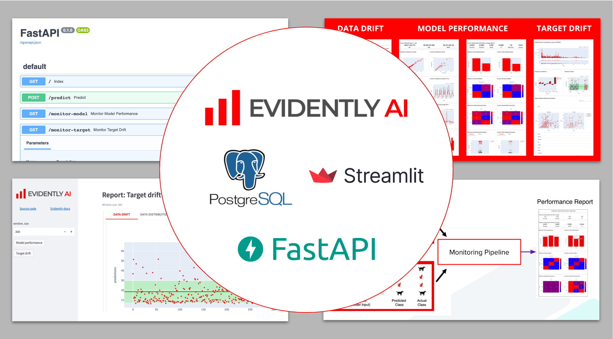

### Streamlit and fastapi based on evidently example https://www.evidentlyai.com/blog/fastapi-tutorial#:~:text=Evidently%20is%20an%20open-source,model%20and%20monitor%20its%20performance


''' git clone repo_url repo_name
''' python -m venv .venv
''' source .venv/bin/activate
''' pip install -r requirements.txt

### to make modules available for import under root run
''' python setup.py bdist_wheel

### from evidently instructions (can skip export):
''' export USER_ID=$(id -u)
''' docker-compose up

### all successful hits to fastapi are stored with autoincremented id in {ModelName}TablePrediction - currently only XGBoost and LinearRegression are supported

''' python src/scripts/create_db.py
or drop db if needed
''' python src/scripts/drop_db.py
### Download data for NYC Taxi to 'data/raw' & prepare features
''' python src/pipelines/load_data.py 
''' python src/pipelines/process_data.py  
### Save to 'data/reference
''' python src/pipelines/prepare_reference_data.py 
### Simulate predictions
''' python src/scripts/simulate.py xgboost_model
''' python src/scripts/simulate.py linear_regression_model
### use query.py in root to query tables for debugging
''' python query.py

### api docs -> can select model and window size and run a report directly from api docs
http://0.0.0.0:5000/docs#/

### then check reports at:
http://0.0.0.0:5000/monitor-model/{model_name}
http://0.0.0.0:5000/monitor-target/{model_name}

--------
Project Organization
------------

    ├── README.md          <- The top-level README for developers using this project.
    ├── config             <- Configs directory
    ├── data
    │   ├── features       <- Features for model training and inference.
    │   ├── raw            <- The original, immutable data dump.
    │   └── reference      <- Reference datasets for monitoring (with subfolders for each model).
    ├── fastapi            <- FastAPI application
    ├── models             <- Trained and serialized models, model predictions, or model summaries (with subfolders for each model).
    ├── reports             <- Monitoring report files
    │
    ├── src                <- Source code for use in this project.
    │   ├── monitoring     <- Common code for monitoring 
    │   │
    │   ├── pipelines      <- Source code for all pipelines
    │   │
    │   ├── scripts        <- Helper scripts
    │   │
    │   ├── utils          <- Utility functions and classes 
    ├── static             <- Assets for docs 
    └── streamlit_app      <- Streamlit application
    
- `streamlit_app` - Streamlit application, available on [http://localhost:8501](http://localhost:8501)
- `fastapi` - FastAPI application, available on [http://localhost:5000](http://localhost:5000)
- `monitoring-db` - PostgreSQL, available on [http://localhost:5432](http://localhost:5432)
  
- tables are described in [src/utils/models.py](src/utils/models.py)
- if you want drop all tables (in case of error or to clear database) and recreate them do:
  
### Preview monitoring reports via Streamlit UI

Streamlit application implements convenient interface to build and render monitoring reports.

To render report:
- open [Streamlit application](http://localhost:8501)
- input required window size (options; 3000 by default)
- click on of two buttons (***Model performance*** or ***Target drift***) and wait report rendering


## :checkered_flag: Stop cluster

```bash
docker compose down
```

<details>
<summary>Notes</summary>

- To clear cluster one needs to remove `Docker` volume containing monitoring (`Postgres`) database
- It may be useful to run this tutorial from scratch
- Run the command:
  
```bash
docker compose down -v
```

</details>
